# PF RDE - Schéma d'architecture cible

```mermaid
flowchart TB
    %% Acteurs
    Public["Usagers publics"]
    External["Partenaires / comptes externes"]
    Agents["Agents RDG"]
    Admins["Managers / administrateurs"]

    %% Frontaux
    subgraph FRONT["Canaux d'accès"]
        Web["Portail public Twig\nAccueil, actualités, catalogue"]
        Extranet["Extranet\nFavoris, demandes de ressources"]
        AgentSpace["Espace agents\nDemandes cartes / données"]
        BackOffice["Back-office EasyAdmin\nAdministration contenus, sources, accès"]
        ApiJson["API JSON\nCatalogue, cartes, SIG, dashboard"]
    end

    %% Application
    subgraph APP["PF RDE - Socle applicatif Symfony 7.4"]
        UI["Couche UI\nContrôleurs, formulaires, templates, endpoints"]
        AppSvc["Couche Application\nServices catalogue, visibilité, SIG, SSO, SIRENE"]
        Domain["Couche Domain\nEntités, règles métier, scopes, publication"]
        Infra["Couche Infrastructure\nRepositories, audit, providers, sécurité technique"]
        Security["Sécurité applicative\nRBAC, CSRF, CSP, audit, scopes"]
    end

    %% Données PF
    subgraph DATA["Données internes PF RDE"]
        Db[("PostgreSQL 16 + PostGIS\nDoctrine ORM + migrations")]
        Files["Stockage fichiers publiés\npublic/files, uploads, data-sources"]
        Logs["Logs et audit\nMonolog + audit_log"]
    end

    %% Référentiels externes
    subgraph EXTERNALS["Services et lots externes"]
        SSO["Microsoft Entra ID / Office 365\nOIDC, claims, rôles"]
        Sirene["API SIRENE INSEE\nValidation SIRET"]
        Mail["SMTP / Mailer\nConfirmation compte, notifications"]
        Matomo["Matomo\nMesure d'audience optionnelle"]
        Basemap["Fonds de carte\nTuiles raster ou fonds internes"]
    end

    %% Lots producteurs
    subgraph LOTS["Lots producteurs / intégrateurs"]
        DataLots["Lots données métier\nCSV, XLSX, GeoJSON, GPKG, SHP.zip, PDF"]
        SigLots["Lots SIG\nWMS, WFS, GeoJSON, GetCapabilities"]
        IamLot["Lot IAM\nRôles, groupes, mapping SSO"]
        ExploitLot["Lot exploitation\nSecrets, sauvegardes, supervision"]
    end

    %% Interop cible
    subgraph CONTRACTS["Contrats d'intégration cibles"]
        Metadata["Bordereau de métadonnées\nslug, titre, thème, catégorie, licence, visibilité"]
        LayerContract["Contrat couche\nname, serviceLayerName, EPSG, attributs, style, filtres"]
        Health["Healthcheck SIG\navailable, message, timeout, mode dégradé"]
        Publish["Process publication\nbrouillon -> contrôle -> publié -> archivé"]
    end

    %% Accès acteurs
    Public --> Web
    Public --> ApiJson
    External --> Extranet
    External --> Web
    Agents --> AgentSpace
    Agents --> Extranet
    Admins --> BackOffice

    %% Front vers app
    Web --> UI
    Extranet --> UI
    AgentSpace --> UI
    BackOffice --> UI
    ApiJson --> UI

    %% Application interne
    UI --> AppSvc
    AppSvc --> Domain
    AppSvc --> Infra
    Infra --> Db
    Infra --> Files
    Infra --> Logs
    Security --> UI
    Security --> AppSvc
    Security --> Domain

    %% Services externes
    AppSvc --> SSO
    AppSvc --> Sirene
    AppSvc --> Mail
    Web --> Matomo
    ApiJson --> Basemap

    %% Lots vers contrats
    DataLots --> Metadata
    DataLots --> Publish
    SigLots --> LayerContract
    SigLots --> Health
    IamLot --> SSO
    IamLot --> Security
    ExploitLot --> Db
    ExploitLot --> Logs

    %% Contrats vers PF
    Metadata --> Domain
    Metadata --> Db
    LayerContract --> AppSvc
    LayerContract --> Db
    Health --> AppSvc
    Publish --> BackOffice

    %% Styles
    classDef actor fill:#ffffff,stroke:#0E5AA7,stroke-width:1px,color:#102A43;
    classDef front fill:#EAF6FB,stroke:#2FA7D9,stroke-width:1px,color:#102A43;
    classDef app fill:#EEF6EA,stroke:#7AA63A,stroke-width:1px,color:#102A43;
    classDef data fill:#FFF5E8,stroke:#E57A22,stroke-width:1px,color:#102A43;
    classDef ext fill:#F4F1FA,stroke:#8A63D2,stroke-width:1px,color:#102A43;
    classDef contract fill:#F6F8FA,stroke:#6B7280,stroke-width:1px,color:#102A43;

    class Public,External,Agents,Admins actor;
    class Web,Extranet,AgentSpace,BackOffice,ApiJson front;
    class UI,AppSvc,Domain,Infra,Security app;
    class Db,Files,Logs data;
    class SSO,Sirene,Mail,Matomo,Basemap,DataLots,SigLots,IamLot,ExploitLot ext;
    class Metadata,LayerContract,Health,Publish contract;
```

## Lecture du schéma

- La PF RDE reste le point d'accès applicatif : portail public, extranet, espace agents, back-office et API JSON.
- Les autres lots ne poussent pas directement du code dans le portail ; ils fournissent des données, services ou contrats d'intégration conformes.
- Les données publiées passent par un processus de gouvernance : brouillon, contrôle, publication, archivage.
- Les services SIG sont consommés via endpoints WMS/WFS/GeoJSON et doivent être supervisables.
- Les accès sont pilotés par les rôles et par les scopes de visibilité : public, external, internal.

## Flux cibles principaux

1. Les lots données livrent fichiers et métadonnées.
2. Les administrateurs contrôlent et publient les sources dans le back-office.
3. Le portail expose les ressources publiées selon la visibilité du profil.
4. Les lots SIG exposent les services WMS/WFS et couches documentées.
5. La PF RDE consomme ces couches via un provider SIG, avec healthcheck et mode dégradé.
6. Le lot IAM fournit les rôles et claims SSO mappés vers ROLE_EXTERNAL, ROLE_AGENT, ROLE_MANAGER et ROLE_ADMIN.
7. L'exploitation porte la base, les secrets, les sauvegardes, les logs, la supervision et les domaines autorisés par la CSP.
